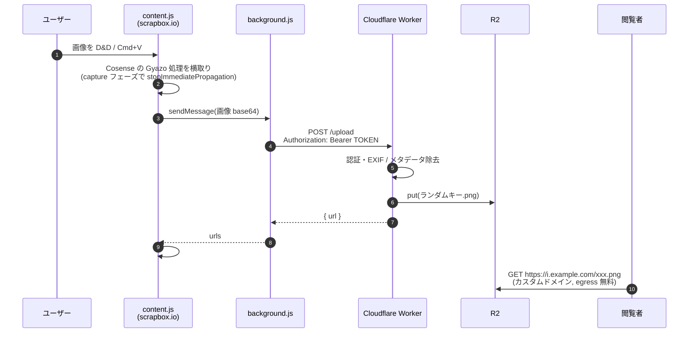

# cosense-uploader

Cosense (scrapbox.io) に画像を D&D / ペーストしたとき、Gyazo の代わりに自前の Cloudflare R2 へアップロードして `[https://...png]` を貼り付ける Chrome 拡張と、その受け口になる Cloudflare Worker。



## 1. Worker + R2 をデプロイ

```sh
cd worker
npm i
npx wrangler login

# R2 バケット作成
npx wrangler r2 bucket create cosense-images

# アップロード用トークン（長いランダム文字列を作って登録）
openssl rand -base64 32          # ← これをコピーしておく
npx wrangler secret put UPLOAD_TOKEN

npx wrangler deploy
```

deploy すると `https://cosense-uploader.<account>.workers.dev` が出ます。これが拡張に入れる **Worker URL** です。

### 配信用カスタムドメイン

1. Cloudflare ダッシュボード → R2 → `cosense-images` → Settings → **Custom Domains** で `i.example.com` などを追加（Cloudflare 管理下のゾーンならワンクリック）。
2. `wrangler.toml` の `PUBLIC_BASE_URL` をそのドメインに書き換えて再 `deploy`。

`PUBLIC_BASE_URL` を Worker 自身の URL にしておけば Worker が `GET /<key>` で R2 から配信するフォールバックも動きます（ただし Worker のリクエスト課金に乗るので、常用はカスタムドメイン推奨）。

### 動作確認

```sh
curl -X POST "https://cosense-uploader.<account>.workers.dev/upload" \
  -H "Authorization: Bearer <UPLOAD_TOKEN>" \
  -H "Content-Type: image/png" \
  --data-binary @some.png
# => {"url":"https://i.example.com/AbCdEf....png","key":"...","bytes":...,"type":"image/png"}
```

## 2. Chrome 拡張を入れる

1. `chrome://extensions` → 右上「デベロッパーモード」ON → 「パッケージ化されていない拡張機能を読み込む」→ `extension/` フォルダを選択。
2. 拡張アイコンをクリック（または「詳細 → 拡張機能のオプション」）で設定画面を開く。
3. **Worker URL** と **アップロードトークン** を入れて「保存」。保存時に Worker のホストへのアクセス許可ダイアログが出るので許可。
4. 「テストアップロード」を押して URL が返ってきて画像が表示されれば OK。

## 使い方

- Cosense のページを開いて、スクショを **D&D** するか、クリップボードの画像を **Cmd+V** → 自前ストレージにアップロードされ、カーソル行に `[https://i.example.com/xxx.png]` が入る。
- **Shift を押しながら D&D** すると、その1回だけ従来の Gyazo アップロードになる。
- 設定画面の「有効にする」を外すと拡張は何もせず、Cosense 標準動作に戻る。

## 挙動の詳細

- 画像は保存前に **EXIF / XMP / コメント / PNG テキストチャンク** を除去する（PNG, JPEG）。画素には触らない。GIF / WebP / AVIF / SVG はそのまま保存。
- キーは 128bit ランダム（base64url）なので URL は推測不能。Gyazo と同じ「URL を知っている人だけ見える」モデル。
- Worker は `Authorization: Bearer <UPLOAD_TOKEN>` を定数時間比較で検証。トークンは拡張の `chrome.storage.sync` にだけ保存され、ページ側の JS からは見えない。
- 上限は `MAX_BYTES`（既定 25MB）。
- Cosense への挿入は隠し textarea `#text-input` に value を入れて `input` イベントを発火する方式（scrapbox-userscript-std の `insertText` と同じ）。Cosense 側の DOM が変わると壊れる可能性あり。

## ファイル構成

```
worker/
  wrangler.toml       R2 バインディング・PUBLIC_BASE_URL
  src/index.js        POST /upload, GET /<key>, 認証, CORS
  src/strip.js        PNG/JPEG メタデータ除去
  test/               strip.js のテスト (npm test)
extension/
  manifest.json       MV3
  content.js          scrapbox.io で drop/paste を横取り → 挿入
  background.js       Worker への fetch（トークンはここだけ）
  options.html/.js    設定・テストアップロード
```

## 既存 Gyazo 画像の救出（別作業）

Gyazo 復旧後に、Cosense のプロジェクトを JSON エクスポート → `gyazo.com` の URL を抽出 → ダウンロード → この Worker に POST → ページ本文を書き換え、というスクリプトを回せば依存を完全に切れます。必要になったら別途。

## License

MIT
